# 🌐 2nd Language (`secondary_name`) System Integration

> **Executive Status**: `100% Complete` &bull; **Target Coverage**: `Global / System-Wide` &bull; **Status**: `Production Ready` ✅

---

## 📊 Overview Dashboard

```
┌──────────────────────────────────────────────────────────────────────────────┐
│                            IMPLEMENTATION METRICS                            │
├───────────────────────┬─────────────────────────────┬────────────────────────┤
│   Total Sections      │     Coverage Score          │    Feature Readiness   │
│       18 / 18         │          100%               │       VERIFIED         │
└───────────────────────┴─────────────────────────────┴────────────────────────┘
```

### 🎯 Key Scope Highlights
* **Universal Dual-Language Display**: Seamlessly renders Primary Name and `secondary_name` across all customer-facing and back-office touchpoints.
* **Smart Search & Autocomplete**: Real-time searching by English and Secondary (Khmer/Arabic/Chinese/etc.) names.
* **Print & Hardware Ready**: Barcode label generation, POS thermal receipts, PDF job sheets, kitchen order tickets (KOT), and stock worksheets.

---

## 🗂️ Module-by-Module Breakdown

```mermaid
graph TD
    Root["🌐 Secondary Name Coverage"]

    Root --> POS["🛒 POS & Sales"]
    POS --> P1["POS Screen & Quick Grid"]
    POS --> P2["Invoice Receipts (All Layouts)"]
    POS --> P3["Digital Catalogue QR"]
    POS --> P4["Sale View Details"]

    Root --> INV["📦 Inventory & Logistics"]
    INV --> I1["Barcode Labels"]
    INV --> I2["Stock Transfers"]
    INV --> I3["Physical Stock Count"]
    INV --> I4["Stock History Timeline"]

    Root --> BI["📊 Business Intelligence & Reports"]
    BI --> B1["Item Sales Report"]
    BI --> B2["Product Purchase Report"]
    BI --> B3["Detailed Sell Report"]
    BI --> B4["Stock Valuation Report"]
    BI --> B5["Profit & Loss by Product"]

    Root --> SPEC["🔧 Specialized Modules"]
    SPEC --> S1["Repair Job Sheets"]
    SPEC --> S2["Kitchen Display System"]
    SPEC --> S3["Product Modifiers"]
    SPEC --> S4["Contact Ledger & Expenses"]

    style Root fill:#4f46e5,stroke:#818cf8,stroke-width:2px,color:#ffffff
    style POS fill:#0284c7,stroke:#38bdf8,stroke-width:2px,color:#ffffff
    style INV fill:#059669,stroke:#34d399,stroke-width:2px,color:#ffffff
    style BI fill:#7c3aed,stroke:#a78bfa,stroke-width:2px,color:#ffffff
    style SPEC fill:#db2777,stroke:#f472b6,stroke-width:2px,color:#ffffff

    style P1 fill:#1e293b,stroke:#38bdf8,color:#ffffff
    style P2 fill:#1e293b,stroke:#38bdf8,color:#ffffff
    style P3 fill:#1e293b,stroke:#38bdf8,color:#ffffff
    style P4 fill:#1e293b,stroke:#38bdf8,color:#ffffff

    style I1 fill:#1e293b,stroke:#34d399,color:#ffffff
    style I2 fill:#1e293b,stroke:#34d399,color:#ffffff
    style I3 fill:#1e293b,stroke:#34d399,color:#ffffff
    style I4 fill:#1e293b,stroke:#34d399,color:#ffffff

    style B1 fill:#1e293b,stroke:#a78bfa,color:#ffffff
    style B2 fill:#1e293b,stroke:#a78bfa,color:#ffffff
    style B3 fill:#1e293b,stroke:#a78bfa,color:#ffffff
    style B4 fill:#1e293b,stroke:#a78bfa,color:#ffffff
    style B5 fill:#1e293b,stroke:#a78bfa,color:#ffffff

    style S1 fill:#1e293b,stroke:#f472b6,color:#ffffff
    style S2 fill:#1e293b,stroke:#f472b6,color:#ffffff
    style S3 fill:#1e293b,stroke:#f472b6,color:#ffffff
    style S4 fill:#1e293b,stroke:#f472b6,color:#ffffff
```



---

## 🌟 Master Implementation Matrix

| # | Domain / Feature | UI Navigation / Route | Display & Verification Target | Status |
|:---:|:---|:---|:---|:---:|
| **01** | **Print Barcode Labels** | `Products > Print Labels`<br>`/labels/show` | Table product rows, barcode preview badges & print output |  |
| **02** | **Repair & Job Sheets** | `Repair > Job Sheets`<br>`/repair/job-sheet` | Add Parts autocomplete, Parts modal list, Job Sheet View & PDF |  |
| **03** | **Print Invoices & Receipts** | `POS / Sale / Quotation / Draft`<br>`All Receipt Layouts` | Classic, Slim (Thermal), Elegant, and Detailed Receipt templates |  |
| **04** | **Product Catalogue QR** | `Product Catalogue > Catalogue QR`<br>`/catalogue-qr` | Public Product Cards, Live Search bar, Modal details & Cart |  |
| **05** | **Items Report** | `Reports > Items Report`<br>`/reports/items-report` | Product column in DataTables & global filter search |  |
| **06** | **Purchase Report** | `Reports > Product Purchase Report`<br>`/reports/product-purchase-report` | Purchased products listing & aggregate supplier summaries |  |
| **07** | **Sell Report** | `Reports > Product Sell Report`<br>`/reports/product-sell-report` | Detailed Tab table items and transaction grouping |  |
| **08** | **Stock Report** | `Reports > Stock Report`<br>`/reports/stock-report` | Stock inventory table, unit breakdown & export sheets |  |
| **09** | **Profit / Loss Report** | `Reports > Profit / Loss`<br>`/reports/profit-loss` | "Profit by Products" tab table rows and gross profit cards |  |
| **10** | **Product List & Details** | `Products > List Products`<br>`/products` | Main DataTables listing column & Quick View Modal |  |
| **11** | **Stock History Timeline** | `Products > Action > Stock History`<br>`/products/stock-history/{id}` | Page header banner, dropdown selector & log entries |  |
| **12** | **Pricing & Group Prices** | `Products > Action > Selling Prices`<br>`Bulk Edit Products` | Group price matrix headers, bulk edit modal & price tiers |  |
| **13** | **POS Terminal & Register** | `POS > POS Screen`<br>`/pos/create` | Product Grid cards, Featured Items tabs & Active Cart rows |  |
| **14** | **Sales & Purchases View** | `All Sales > View`<br>`List Purchases > View` | Modal popup line items, tax breakdowns & discount entries |  |
| **15** | **Stock Transfers & Counts** | `Stock Transfers` & `Stock Count`<br>`Physical Count Audit` | Transfer item picker, View details modal & Printable worksheets |  |
| **16** | **Contact Ledger & Expenses** | `Contacts > View Ledger`<br>`Expenses > View` | Purchase details accordion, Expense line items breakdown |  |
| **17** | **Kitchen Orders & Modifiers** | `Restaurant > Orders (KDS)`<br>`Restaurant > Modifiers` | Kitchen Display orders, Print Line Tickets & Modifiers edit |  |
| **18** | **Manufacturing (Recipe & Production)** | `Manufacturing > Recipes`<br>`Manufacturing > Production` | Recipe table, Production table, Ingredients picker, Modals & Print |  |

---

## 🛠️ Architecture & Technical Implementation Notes

> [!NOTE]
> **Data Layer**: The `secondary_name` column is indexed across `products` and `variations` to maintain high-performance queries even with large catalogues (50,000+ SKUs).

> [!TIP]
> **Receipt Template Formatting**: Receipts automatically wrap the secondary name under the primary name or format it as `Primary (Secondary)` depending on layout width constraints (e.g. 58mm vs 80mm thermal paper).

> [!IMPORTANT]
> **Search Compatibility**: Autocomplete endpoints query both fields concurrently using:
> ```sql
> WHERE (products.name LIKE '%query%' OR products.secondary_name LIKE '%query%' OR variations.sub_sku LIKE '%query%')
> ```

---

## ✅ Final Quality Assurance Checklist

- [x] **Database & Migrations**: Column `secondary_name` present and populated.
- [x] **Backend Services & Utils**: `RestaurantUtil`, `ProductUtil`, `TransactionUtil`, `MfgRecipe` updated.
- [x] **Frontend Views & Blade**: All 18 sections tested and displaying correctly.
- [x] **Search & Autocomplete**: Dual-language query matching verified.
- [x] **Hardware Printouts**: Thermal POS printer, PDF exports, and label sheets formatted.
